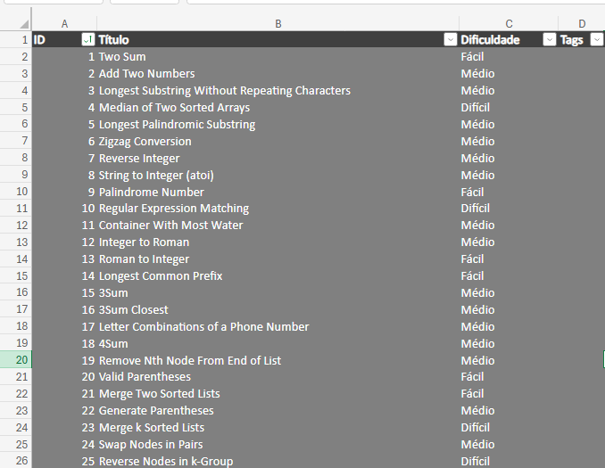

# LeetCode Exporter


[](https://dotnet.microsoft.com/)
[](LICENSE)

Este projeto consome a API pública do LeetCode e exporta todos os problemas para um arquivo Excel `.xlsx`, com colunas organizadas: ID, Título, Dificuldade e Tags.

---

## 🔧 Funcionalidades

- 🔹 Baixa o JSON de `https://leetcode.com/api/problems/all/`
- 🔹 Filtra por dificuldade: `Fácil`, `Médio` ou `Difícil`
- 🔹 Gera uma planilha `.xlsx` com todos os problemas organizados
- 🔹 Usa `ClosedXML` para gerar Excel com colunas ajustadas automaticamente

---

## ✅ Requisitos

- [.NET 6 ou superior](https://dotnet.microsoft.com/en-us/download/dotnet/6.0)

---

## 📦 Instalação

1. Clone o repositório:

```bash
git clone https://github.com/seu-usuario/LeetCodeExporter.git
cd LeetCodeExporter
```

2. Instale os pacotes necessários:

```bash
dotnet add package Newtonsoft.Json
dotnet add package ClosedXML
```

3. Execute o projeto:

```bash
dotnet run
```

## ✏️ Personalização
- Para filtrar os problemas por dificuldade, altere esta linha no Program.cs:

```csharp
string? difficultyFilter = "Médio"; // Use "Fácil", "Médio", "Difícil" ou null para todos
```

## 📁 Resultado
- O programa gerará um arquivo chamado leetcode_problems.xlsx na pasta do projeto.

## 📊 Exemplo do Resultado

Gera um Excel como este:

| ID  | Título                           | Dificuldade | Tags                     |
|-----|----------------------------------|-------------|--------------------------|
| 1   | Two Sum                          | Fácil       | Array, Hash Table        |
| 2   | Add Two Numbers                  | Médio       | Linked List, Math        |

### Feito com ❤️ para devs que querem estudar LeetCode de forma organizada!